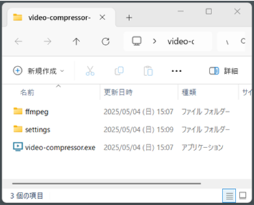
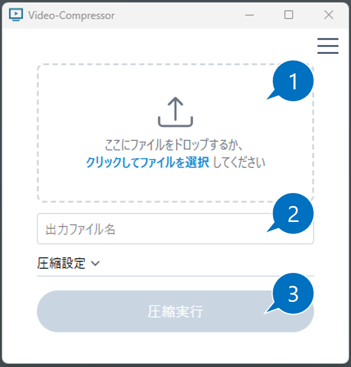
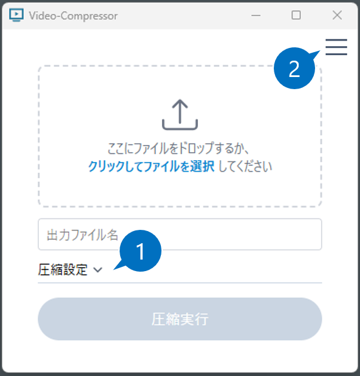
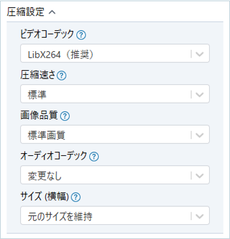
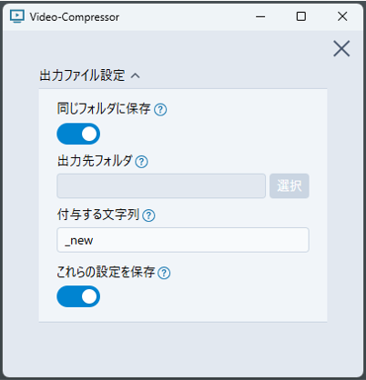

# Video Compressor

動画ファイルを圧縮するツールです。

## 1. 目次 

- [1. 目次](#1-目次)
- [2. アプリを使う準備](#2-アプリを使う準備)
- [3. 使い方](#3-使い方)
- [4. 設定項目](#4-設定項目)
- [5. 圧縮設定詳細](#5-圧縮設定詳細)
  - [5.1. ビデオコーデック](#51-ビデオコーデック)
  - [5.2. 圧縮速さ](#52-圧縮速さ)
  - [5.3. 画像品質](#53-画像品質)
  - [5.4. オーディオコーデック](#54-オーディオコーデック)
  - [5.5. サイズ (横幅)](#55-サイズ-横幅)
- [6. アプリ設定](#6-アプリ設定)
  - [6.1. 同じフォルダに保存](#61-同じフォルダに保存)
  - [6.2. 出力先フォルダ](#62-出力先フォルダ)
  - [6.3. 付与する文字列](#63-付与する文字列)
  - [6.4. これらの設定を保存](#64-これらの設定を保存)
- [7. ライセンスに関する注意](#7-ライセンスに関する注意)

## 2. アプリを使う準備 

1. 本リポジトリの「video-compressor-app.zip」をダウンロードして解凍してください。 
2. フォルダ内の exe ファイルをダブルクリックして実行します。 

※ メモ 

- このアプリは FFmpeg を使用します。そのバイナリファイルが ffmpeg フォルダに保存されています。 
- settings フォルダにはアプリの設定ファイルが保存されます。 
   

## 3. 使い方 

1. 圧縮したいファイルをドラッグアンドドロップします。またはアップロードするエリアをクリックして圧縮したいファイルを選択します。 
    
2. 圧縮後のファイル名を指定します。元ファイルを 1 で指定すると、出力ファイルパスは自動で作成されます。 作成されるファイルパスは後述するアプリ設定で変更できます。 
3. 圧縮実行ボタンをクリックすると圧縮を開始します。 

## 4. 設定項目 

圧縮設定（下図 1）とアプリ設定（下図 2）があります。詳細は次セクションで説明します。 

1. 圧縮に関する設定です。圧縮の品質や速さ、圧縮後のファイルサイズに影響が出ます。 
2. アプリの設定です。出力するファイル名の作成方法などを指定します。 
    

## 5. 圧縮設定詳細 

｢圧縮設定」をクリックすると表示されます。 

### 5.1. ビデオコーデック 

圧縮方式を選択します。LibX264 と LibX265 があり、LibX265 がより新しい圧縮方式です。ただし、LibX265 はデバイスによっては再生できないことがあるため、LibX264 の使用を推奨します。 

### 5.2. 圧縮速さ 

圧縮する速さを選択します。圧縮速さが速い程圧縮にかかる時間は短くなりますが、画質は落ちる傾向にあります。 

### 5.3. 画像品質 

圧縮後の画像品質を選択します。高画質な程ファイルサイズは大きくなります。 

### 5.4. オーディオコーデック 

音声の圧縮方式を選択します。 
｢変更なし」を選択すれば、元動画の音声をそのまま使用します。 
｢オーディオを削除」を選択すれば、音声を削除することもできます。 

### 5.5. サイズ (横幅) 

圧縮後の動画の横幅を選択します。立幅は元の動画の縦横比から自動で計算されます。 
横幅が小さい程ファイルは軽くなります。 

 

## 6. アプリ設定 

右上のハンバーガーアイコンをクリックすると表示されます。 
圧縮したい動画を指定した時に圧縮後のファイルパスが自動で表示されますが、これらはこの圧縮後のファイルパスに関する設定です。 

### 6.1. 同じフォルダに保存 

ファイル出力先を元動画と同じフォルダに指定します。

### 6.2. 出力先フォルダ 

上記の設定を OFF にすると、ここで出力先のフォルダが指定できます。 

### 6.3. 付与する文字列 

元動画に対してファイル名に付与する文字列を指定できます。 
例) movie.mp4 → movie_compressed.mp4 

### 6.4. これらの設定を保存 

この設定を ON にすると、次回起動時に 6.1 ～ 6.4 までの設定を自動で読み出して設定します。 

 

## 7. ライセンスに関する注意 

このソフトウェアには、[FFmpeg](https://ffmpeg.org/) のスタティックバイナリが含まれています。 
FFmpeg は [GNU General Public License Version 3 (GPLv3)](https://www.gnu.org/licenses/gpl-3.0.html) またはそれ以降のバージョンの下でライセンスされています。 
本ソフトウェアのライセンスは GPL-3.0-or-later とし、FFmpeg のライセンス要件に準拠しています。 
使用している FFmpeg のバージョンは **7.1.1** であり、[gyan.dev](https://www.gyan.dev/ffmpeg/builds/) より入手したバイナリを同梱しています。 
FFmpeg のライセンス情報および著作権表示は `src-tauri/ffmpeg/LICENSE` に含まれています。 

以上
 
